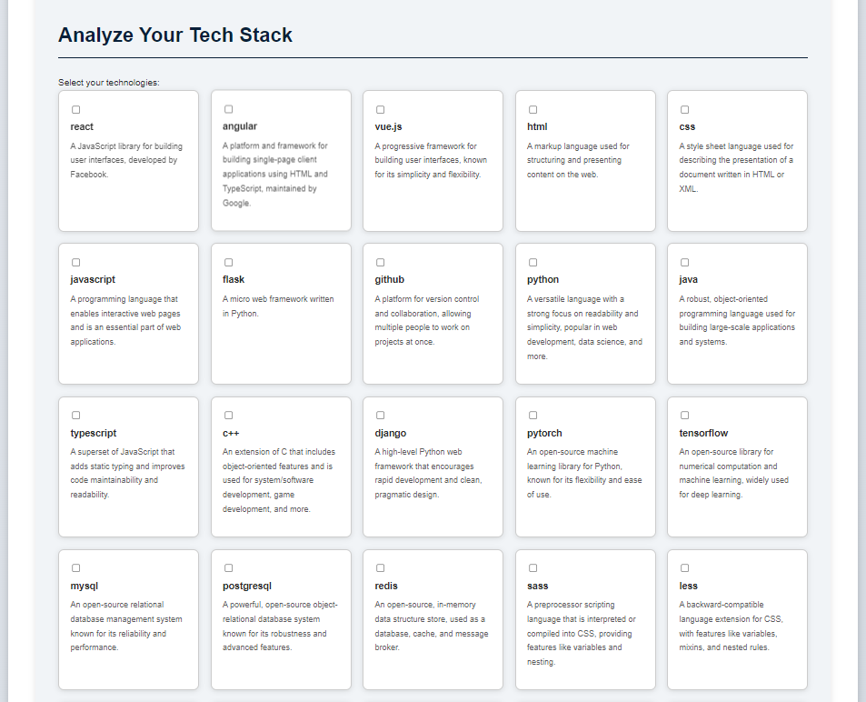
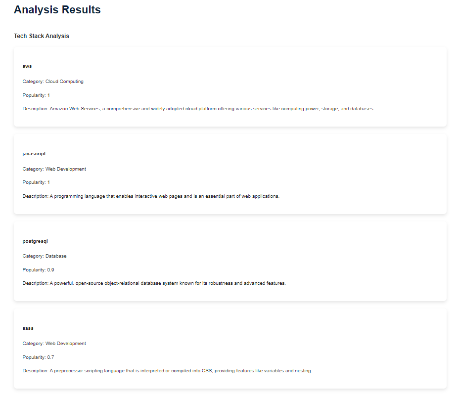
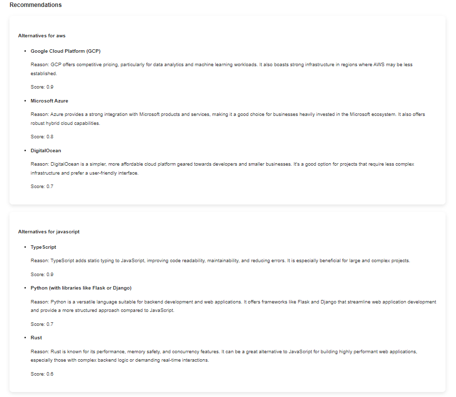

# Tech Stack Analyzer

## Overview

The **Tech Stack Analyzer** is a simple web application built with Flask that empowers users to analyze their technology stack. It identifies technologies, assesses their characteristics, and provides data-driven recommendations for alternatives based on comprehensive analysis results.

## Table of Contents

- [Features](#features)
- [Technologies Used](#technologies-used)
- [Usage](#usage)
- [API Endpoints](#api-endpoints)
- [Contributing](#contributing)
- [License](#license)

## Features

- **In-depth Analysis**: Examine selected technologies to retrieve detailed descriptions, categories, and popularity metrics.
- **Smart Recommendations**: Get tailored suggestions for alternative technologies based on your current stack.
- **Holistic Evaluation**: Receive an overall assessment of your tech stack, highlighting strengths and potential areas for improvement.
- **User-friendly Interface**: Intuitive web interface for easy technology selection and result visualization.

## Technologies Used

- **Python**: Core programming language (3.8+)
- **Flask**: Web framework for building the application
- **SQLAlchemy**: ORM for database interactions
- **PostgreSQL**: Robust relational database (12+)
- **WTForms**: Form handling and validation
- **Google Generative AI (Gemini)**: Advanced language model for enhanced analysis

## Usage

1. Access the web application through your browser.
2. Select the technologies that comprise your current stack.
3. Click the "Analyze" button to initiate the assessment.
4. Review the detailed analysis results, including:
   - Technology descriptions and categorizations
   - Popularity metrics and trends
   - Recommended alternatives
   - Overall stack evaluation

## API Endpoints

The Tech Stack Analyzer provides a RESTful API for programmatic access:

- `POST /api/analyze`: Submit a list of technologies for analysis
- `GET /api/technologies`: Retrieve a list of all supported technologies
- `GET /api/recommendations`: Get technology recommendations based on specific criteria

## License

This project is licensed under the MIT License. See the `LICENSE` file for details.
